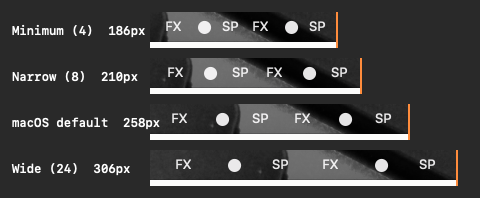

# プリセットごとの見え方

2026-09-15、macOS 27.0 (26A428)、Apple Silicon。

同じ 6 個のフィクスチャアイコンを、各プリセットで撮影したものです。描き直しも拡大縮小も
していません。各行は撮影したピクセルそのもので、左端を揃えて 1 枚に並べ、
行の右端にオレンジの目印を付けて差を目で測れるようにしています。



## 6 個のアイコンが占める幅

| プリセット | 6 個の幅 | 既定との差 |
|---|---:|---:|
| 最小 (4) | 174 px | −72 px (−29%) |
| 狭い (8) | 198 px | −48 px (−20%) |
| macOS 既定 | 246 px | — |
| 広い (24) | 294 px | +48 px (+20%) |

幅は 6 項目それぞれのウィンドウ幅の合計（`evidence/screenshots/capture.json` の
`item_window_widths`）。この表は以前、各写真の切り出し幅——12 px の余白を含む 186 / 210 /
258 / 306——を載せ、百分率もそこから出していた。

1 アイコンあたりではそれぞれ 12・8・−8 ポイントで、
[Phase 1 の計測結果](phase1-results.ja.md)の `幅 ≒ intrinsic + N` と一致します。

サードパーティのアイコンを 12 個並べたメニューバーなら、最小で約 145 ポイント
——アプリメニュー 2 つぶんほどの幅——が空きます。

## 実際に見て分かりにくい理由

1 行だけでは判断できません。アプリの最初の実装がまさにそれで——実物のアイコン 1 列が
メニューバーに 1 度出るだけ——実際に試して判断できませんでした。上の画像で差が明白なのは、
4 列が積み重なって左端を共有しているからにすぎません。

これは機構の限界ではなく、**1 行しか見せないことの限界**です。間隔は確かに、
幅の 5 分の 1 から 4 分の 1 という目に見える量で変わっています。
ただし人間は直前の行を頭の中に正確に保持できないため、単独では気づけません。
そのためアプリは、この同じ寸法で比較をウィンドウ内に描きます。

## 撮影方法

`spikes/capture_spacing.py` が 2 キーをバックアップし、プリセットを順に巡り、
各値でステータス項目 6 個を保持するフィクスチャを起動して、
**フィクスチャ自身の項目だけ**を撮影します。切り抜き範囲はフィクスチャが報告する
座標から計算するため、利用者の実際のメニューバーは写りません。
キーは元の値へ正確に復元し、新しいプロセスで読み直して確認します。

```bash
swift build -c release
python3 spikes/capture_spacing.py run /absolute/output-directory
```

元の撮影データと各段階の記録は
[evidence/screenshots](../../evidence/screenshots) にあります。

## 効かない範囲

実機で使ってみて、自作フィクスチャの計測では分からない限界が 2 つ見つかりました。

- **macOS 標準のアイコンは間隔が変わりません。** Wi-Fi・バッテリー・時計・
  コントロールセンター・入力メニューは、サインアウトの前後どちらでも動きませんでした。
- **全体に反映するにはサインアウトして入り直す必要があります。** 1 つのアプリを
  終了して開き直せばそのアプリのアイコンは動きますが、残りの多くは個別に終了できない
  ヘルパーが持っています。

裏付けの計測（間隔 8、サインインで全プロセスが起動し直した状態の 1 フレーム）:
自前の新規アイコン 6 個は中心間 29〜30px、サードパーティのアイコンは 26〜33px
（平均 ≈29）、macOS 標準のアイコン群は 34〜38px（平均 ≈36）——既定が作る値でした。
これは観察と整合するというだけで、証明ではありません。アイコンごとに字形の幅が違い、
決着をつけられるのはサインアウトを挟んだ前後比較だけです。その前後比較が、
上の利用者自身の観察にあたります。

## 限界

- 自作の 6 アイコンであり、実際のメニューバーのような幅の混在ではありません。
- ディスプレイ 1 台・1 つの倍率・1 つの壁紙での結果です。
- 幅は AppKit が報告するポイント値で、撮影画像はその結果のピクセルです。
- 値 4 でクリックしやすいかどうかについては、何も言えていません。
